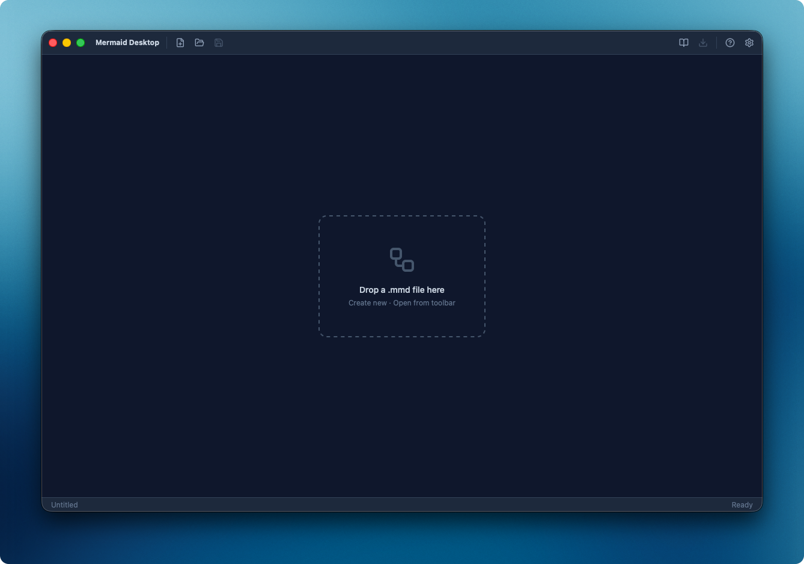
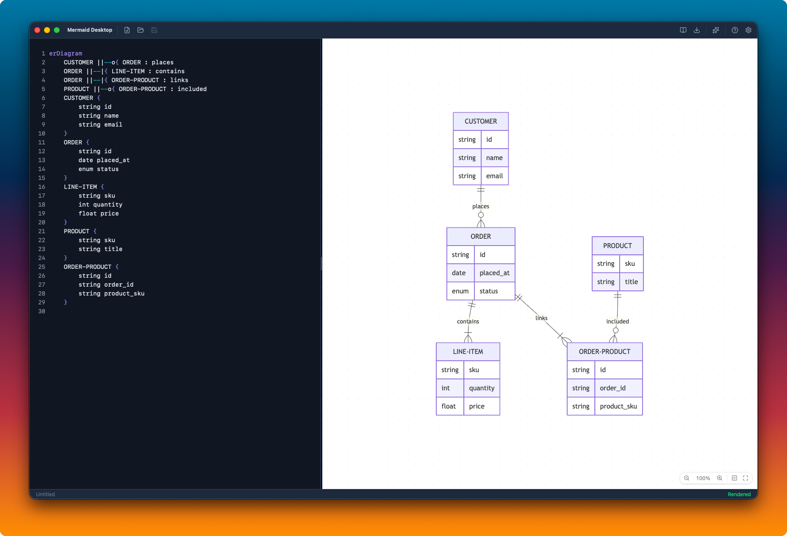
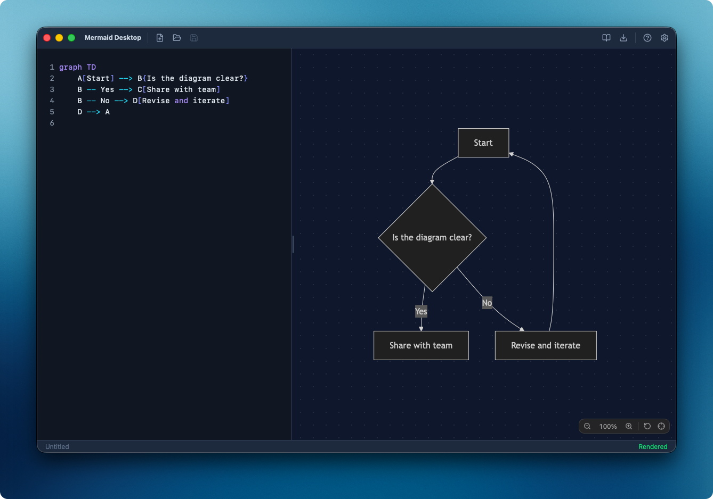
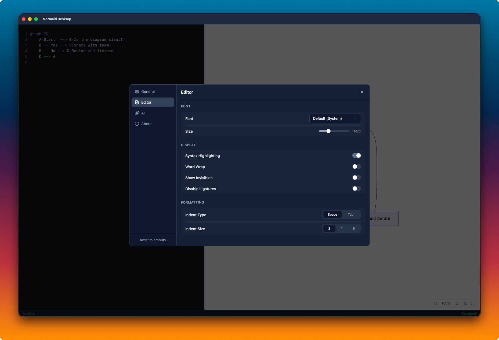

# Mermaid Desktop

A desktop editor for [Mermaid](https://mermaid.js.org/) diagrams. Write markup with syntax highlighting, see it render in real time, and export to SVG or PNG.

Built with [Tauri 2](https://tauri.app/), [React 19](https://react.dev/), [CodeMirror 6](https://codemirror.net/), and [Mermaid 11](https://mermaid.js.org/).

<table align="center">
  <tr>
    <td align="center">
      
      <br><sub>Drop files or create from scratch</sub>
    </td>
    <td align="center">
      
      <br><sub>Real-time preview for complex diagrams</sub>
    </td>
  </tr>
  <tr>
    <td align="center">
      
      <br><sub>Live editing with syntax highlighting</sub>
    </td>
    <td align="center">
      
      <br><sub>Fully configurable editor</sub>
    </td>
  </tr>
</table>

---

## Features

### Editor

- **Syntax highlighting** for Mermaid keywords, arrows, strings, comments, and brackets
- **Live preview** — see your diagram update as you type
- Configurable **font family** (auto-detected system monospace fonts), **font size**, **ligatures**, **indent style**, **word wrap**, and **whitespace visibility** — all applied live

### Canvas Preview

- **Scroll to zoom** — smooth, cursor-anchored (no modifier key required)
- **Drag to pan** — click and drag anywhere on the canvas
- **Fit to viewport** — auto-fits on render; manual fit, reset, and step zoom via toolbar
- **Diagram theme** — independent light/dark/system setting, separate from the app theme

### File Management

- **New / Open / Save** with native file dialogs — untitled documents prompt for a location on first save
- **Auto-save** — optional, saves automatically while you work
- **External file watch** — detects changes made outside the app; auto-reloads if clean, prompts if dirty
- **Drag and drop** — drop `.mmd`, `.mermaid`, or `.md` files to open
- **File associations** — registered as editor for `.mmd` and `.mermaid`
- **Input guards** — files larger than 5 MB, or whose contents look binary, are refused with an explanation rather than loaded

### Export

| Format  | Details                                                   |
| ------- | --------------------------------------------------------- |
| SVG     | Normalized with explicit `width`, `height`, and `viewBox` |
| PNG     | Minimum 512px on shortest side, themed background         |
| PNG @2x | 2x scale, minimum 1024px, `@2x` filename suffix           |

PNG exports are clamped to the browser canvas limits — 16,384px per axis and roughly 16.7M pixels of total area. Very large diagrams are scaled down to fit, preserving aspect ratio, instead of producing an empty file.

### AI Assistant

A collapsible right-hand panel (⌘⇧A) that generates and edits diagrams in conversation. Describe a change, and the assistant rewrites the diagram — its reply is applied to the editor straight away, with **Apply** to keep it or **Cancel** to restore exactly what was there before. Hand-editing the diagram accepts the suggestion implicitly. Each turn sends the current editor content, so the assistant always works from what is actually on screen, including your own edits.

| Provider          | Needs                     |
| ----------------- | ------------------------- |
| Anthropic         | API key + model           |
| OpenAI            | API key + model           |
| Ollama            | Base URL + model          |
| OpenAI Compatible | API key, base URL + model |

Configure any or all of them under **Settings → AI**, and switch between them from the panel's dropdown. Each has a **Test** button that verifies the credentials before you rely on them.

All provider requests are made from the Rust backend, never the webview — the app's `default-src 'self'` content security policy is unchanged. **API keys are stored in the OS keychain** (Keychain on macOS, Credential Manager on Windows, Secret Service on Linux), never in `settings.json`, and are never sent to the frontend after being saved.

### Built-in Examples

Seven starter diagrams: Flowchart, Class, Sequence, Entity Relationship, State, Gantt, and Git Graph.

### App

- **Themes** — Light, Dark, or System for both app chrome and diagram rendering
- **Resizable split pane** — 40/60 default, drag to resize, double-click to reset; focusable and adjustable with arrow keys (Home resets)
- **Window state persistence** — size, position, and preferences saved between sessions
- **Keyboard shortcuts**:

| Shortcut             | Action              |
| -------------------- | ------------------- |
| Cmd/Ctrl + N         | New diagram         |
| Cmd/Ctrl + O         | Open file           |
| Cmd/Ctrl + S         | Save                |
| Cmd/Ctrl + ,         | Settings            |
| Cmd/Ctrl + ? / F1    | Help                |
| Cmd/Ctrl + Shift + A | Toggle AI assistant |

---

## Getting Started

### Prerequisites

- [Node.js](https://nodejs.org/) 22+
- [pnpm](https://pnpm.io/)
- [Rust toolchain](https://www.rust-lang.org/learn/get-started)
- Platform-specific dependencies per the [Tauri prerequisites](https://tauri.app/start/prerequisites/)

### Development

```bash
# Install dependencies
pnpm install

# Run the app with live reload
pnpm tauri dev
```

### Production Build

```bash
pnpm tauri build
# Produces a platform-specific bundle (.app, .msi, .deb, etc.)
# Output: src-tauri/target/release/bundle/
```

On macOS, a convenience script builds and copies the `.app` into a top-level `dist/` folder so you don't have to dig into the Cargo target directory:

```bash
pnpm dist
# Output: dist/Mermaid Desktop.app
```

> **Note:** `pnpm dist` wipes the `dist/` folder on each run, and Vite also uses `dist/` as its frontend output directory. Running `pnpm build` or `pnpm tauri build` after `pnpm dist` will overwrite the `.app` with Vite's frontend bundle — re-run `pnpm dist` to regenerate.

---

## Scripts

| Command            | Description                                 |
| ------------------ | ------------------------------------------- |
| `pnpm tauri dev`   | Run the app with live reload                |
| `pnpm tauri build` | Production build (platform-specific bundle) |
| `pnpm dist`        | macOS: build and copy `.app` into `dist/`   |
| `pnpm test`        | Run tests                                   |
| `pnpm test:watch`  | Run tests in watch mode                     |
| `pnpm typecheck`   | Type-check without emitting                 |
| `pnpm lint`        | Lint and format check                       |
| `pnpm lint:fix`    | Lint and format, applying fixes             |

---

## Tech Stack

|              |                          |
| ------------ | ------------------------ |
| **Runtime**  | Tauri 2 (Rust + WebView) |
| **Frontend** | React 19, TypeScript 7   |
| **Build**    | Vite 8                   |
| **Styling**  | Tailwind CSS 4, Radix UI |
| **Editor**   | CodeMirror 6             |
| **Diagrams** | Mermaid 11 + ZenUML      |
| **Linting**  | Biome                    |
| **Testing**  | Vitest                   |

---

## License

MIT
